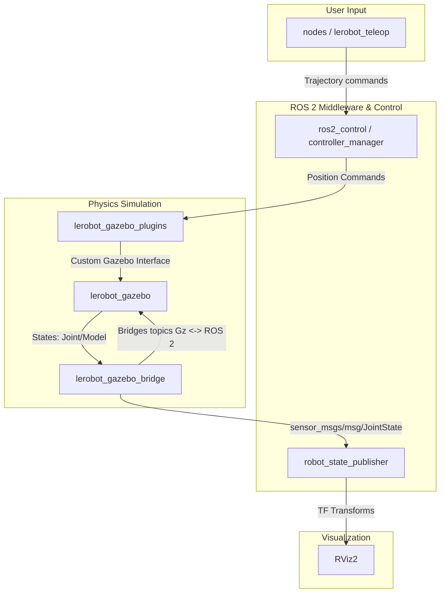

# LeRobot SO-101 (gabos_arm) - ROS 2 and Gazebo Simulation

This repository contains the configuration, description, and simulation files for the **LeRobot** robotic arm (also referred to as `gabos_arm` or "el brazo de gabo" xd) using **ROS 2** and the **Gazebo** (Ignition/Gz) simulator.

---

## 🏗️ General System Architecture

The architecture of this project follows a decoupled robotics pattern in ROS 2, where the robot description (URDF/Xacro), simulation physics (Gazebo), communication bridge (`ros_gz_bridge`), control system (`ros2_control`), and user control nodes (Teleoperation) are modularized into separate packages.

### Package Relationship Diagram
The following diagram shows how the packages created for this simulation interact with each other:



### Control Flow Diagram (Teleoperation)
When controlling the robotic arm via terminal keyboard input, the information travels through the following topic flow:

```mermaid
graph LR
    user((User)) -->|Keys w / s / 1-6| teleop[Node: teleop_joints]
    teleop -->|/lerobot_controller/joint_trajectory| jtc[JointTrajectoryController]
    jtc -->|ros2_control| adapter[LerobotMoveItAdapter]
    adapter -->|gz::transport /lerobot/X_cmd_pos| gz[Gazebo Sim Engine]
    gz -->|Model: /lerobot/joint_states| bridge[ros_gz_bridge]
    bridge -->|/lerobot/sim/joint_states| state_pub[robot_state_publisher]
    state_pub -->|TF Frames| rviz[RViz2 Visualization]
```



---

## 📦 Package Summaries

### 1. `lerobot_description`
This package contains the digital twin description of the robot (visual meshes, joint constraints, inertias, and link properties).
*   **`urdf/so101.urdf.xacro`**: Parametric description file in Xacro format defining the SO-101 robot geometry (6 joints), collisions, inertias, and 3D STL mesh references.
*   **`launch/display.launch.py`**: Static visualization tool for inspection in **RViz2**. It launches a joint state publisher GUI (`joint_state_publisher_gui`) that provides slider bars to rotate each joint manually.
*   **`launch/publish_urdf.launch.py`**: Runs the `robot_state_publisher` node, which converts the Xacro file to raw URDF and publishes the model to the `/robot_description` topic.

### 2. `lerobot_gazebo`
Manages the virtual environments and simulation launching in Gazebo.
*   **`worlds/main_world.sdf`**: Describes the virtual simulation world, including global gravity, physics step parameters, ground planes, and lighting configurations.
*   **`launch/start_gazebo.launch.py`**: The main simulation launcher. It opens Gazebo, loads the URDF description, spawns the robot at specific coordinate positions (`[x: 0.29, y: -0.25, z: 0.77]`), loads environment scenery models, starts the topic bridge, and registers the controllers after a safe startup delay.

### 3. `lerobot_gazebo_bridge`
Acts as a translator mapping signals between Gazebo's internal middleware (`gz::transport`) and standard ROS 2 topics.
*   **`config/bridge_config.yaml`**: The bridge configuration YAML file that maps Gazebo joint/model states (e.g. `/lerobot/joint_states`) to ROS 2 topics (`/lerobot/sim/joint_states`) and joint position commands from ROS 2 to Gazebo (`/lerobot/X_cmd_pos`).
*   **`launch/gazebo_bridge.launch.py`**: Starts the `parameter_bridge` executable from the `ros_gz_bridge` package using the mapping rules in the config file.

### 4. `lerobot_gazebo_plugins`
Contains `ros2_control` hardware interface integrations and adapters to command joints within Gazebo.
*   **`src/lerobot_hardware_interface.cpp`**: Hardware system interface class inheriting from `gz_ros2_control::GazeboSimSystemInterface` to manage lifecycle transitions.
*   **`src/lerobot_moveit_adapter.cpp`**: An adapter that translates trajectory position goals from high-level nodes (like MoveIt or Teleop) into low-level position commands and sends them directly to Gazebo joints via the custom command topics (`/lerobot/X_cmd_pos`).
*   **`config/topic_parameters.yaml`**: Configures the ROS 2 `controller_manager`, registering and starting the `joint_state_broadcaster` and the trajectory controller (`lerobot_controller` of type `joint_trajectory_controller/JointTrajectoryController`).

### 5. `nodes`
Houses user-facing execution scripts and custom nodes written in Python.
*   **`lerobot_teleop/teleop_joints.py`**: Implements the `teleop_joints` node. It captures keyboard input from the terminal in a non-blocking loop:
    *   **Keys `1` to `6`**: Selects the active joint to manipulate.
    *   **Keys `w` / `s`**: Increases (`w`) or decreases (`s`) the target position of the selected joint.
    *   **Key `q`**: Safely quits the teleoperation prompt.
    *   **Output**: Publishes target states as `trajectory_msgs/msg/JointTrajectory` messages on the `/lerobot_controller/joint_trajectory` topic.

---

## 🛠️ Compilation / Build Process

Follow these instructions to build the workspace:

1.  **Install Simulation Dependencies**:
    Make sure the Gazebo and control packages for your ROS 2 distribution are installed:
    ```bash
    sudo apt update
    sudo apt install ros-${ROS_DISTRO}-ros-gz-sim \
                     ros-${ROS_DISTRO}-ros-gz-bridge \
                     ros-${ROS_DISTRO}-gz-ros2-control \
                     ros-${ROS_DISTRO}-joint-state-publisher-gui \
                     ros-${ROS_DISTRO}-xacro
    ```

2.  **Build the Workspace**:
    From the root directory of your workspace (e.g., `/home/marlon/gabos_arm_ws/`):
    ```bash
    colcon build --symlink-install
    ```

3.  **Source the Workspace**:
    ```bash
    source install/setup.bash
    ```

---

## 🚀 How to Run and Visualize

### Option A: Static Mesh Visualization in RViz2 (lerobot_description)
Great for inspecting URDF joints, collision models, and frames without running any physics simulation:
```bash
ros2 launch lerobot_description display.launch.py
```
*This opens RViz2 and a controller GUI window where you can drag sliders to rotate the joint meshes.*

### Option B: Physics Simulation in Gazebo (lerobot_gazebo)
Runs the full physical simulation environment with dynamic controllers and topic bridges:

1.  **Launch the Simulator**:
    ```bash
    ros2 launch lerobot_gazebo start_gazebo.launch.py
    ```
    *Wait for the Gazebo GUI window to load. The robotic arm will spawn in its starting position and the ROS 2 controllers (`joint_state_broadcaster` and `lerobot_controller`) will be registered and activated automatically.*

2.  **Run the Teleoperation Node**:
    Open a new terminal, load the workspace environment, and execute:
    ```bash
    source install/setup.bash
    ros2 run nodes teleop_joints
    ```
    You will see the interactive teleoperation prompt in the console:
    ```text
    --- CONTROL DE JOINTS ---
    Seleccionar Joint: Teclas 1 - 6
    Mover: 'w' (Subir/+)  's' (Bajar/-)
    Salir: 'q' o Ctrl+C
    -------------------------
    Joint Activo: [1] | Pos: 0.00
    ```
    *Use your keyboard to select joints (1-6) and move them (w/s) to see the simulated arm move inside Gazebo.*
